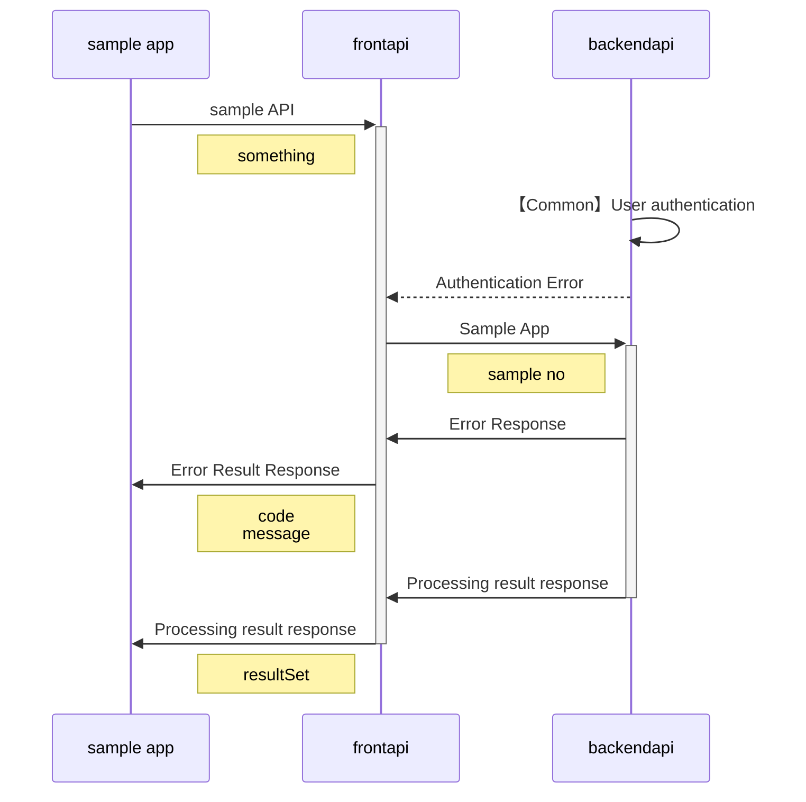

<link href="./style.css" rel="stylesheet"></link>

Sample API</sapn>

- [1. API概要](#1-api概要)
- [2.API仕様](#2api仕様)
  - [2.1. 処理シーケンス](#21-処理シーケンス)

# 1. API概要
 Sample words for API testing title.

# 2.API仕様
 Sample API仕様 
 testing testing testing testing

## 2.1. 処理シーケンス

 