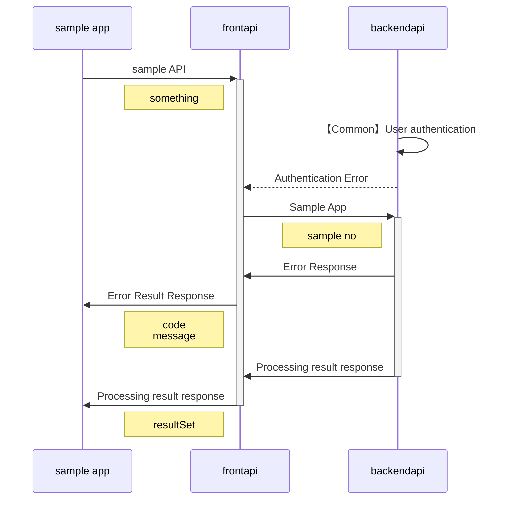

<link href="./style.css" rel="stylesheet"></link>

Sample API</sapn>

- [1. API概要](#1-api概要)
- [2.API仕様](#2api仕様)
  - [2.1. データ情報](#21-データ情報)
    - [2.1.1. テーブル情報](#211-テーブル情報)
  - [2.2. 処理シーケンス](#22-処理シーケンス)

# 1. API概要
 Sample words for API testing title.

# 2.API仕様
 サンプル API仕様 
 testing testing testing testing
## 2.1. データ情報

### 2.1.1. テーブル情報
| パラメータ名 | データ型 | 配列指定 | 必須 | 説明 | 
| ----------- | ------- | ------- | ---- | ---- |
| authtoken | 文字列|  | ○ | authtoken |
| sample no | 文字列 |  | ○ | sample card info's CardNo |

## 2.2. 処理シーケンス

 
